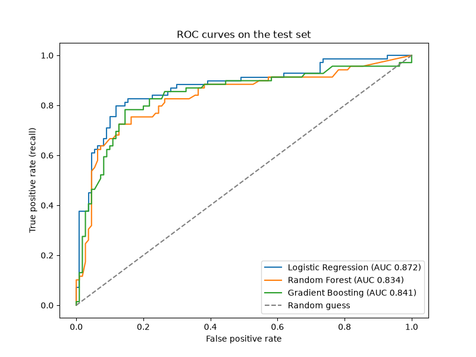
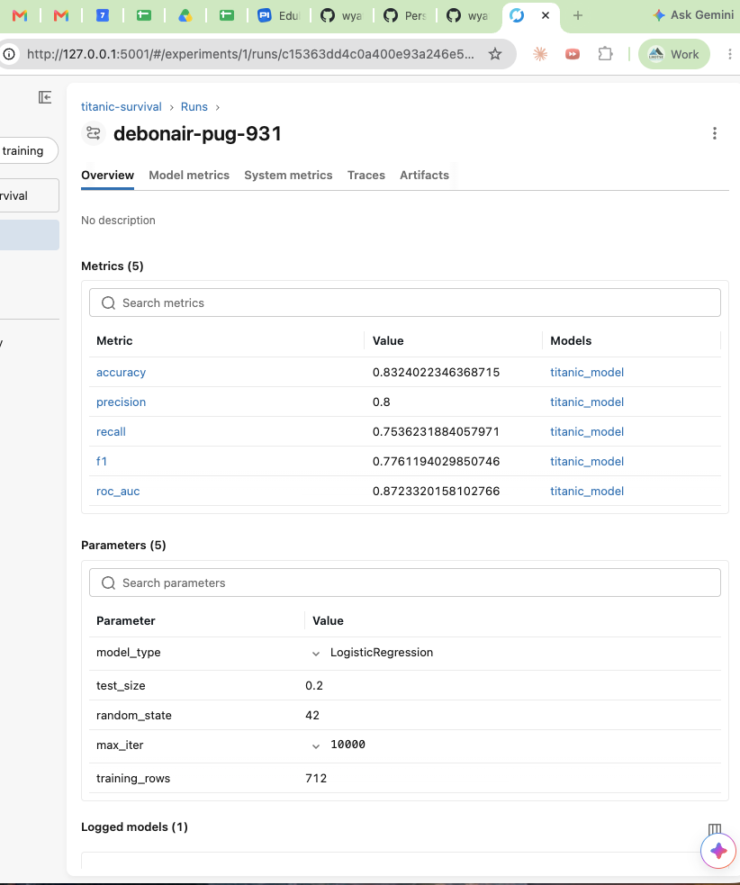
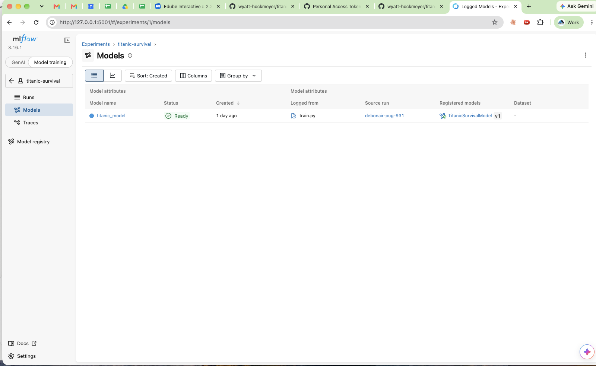
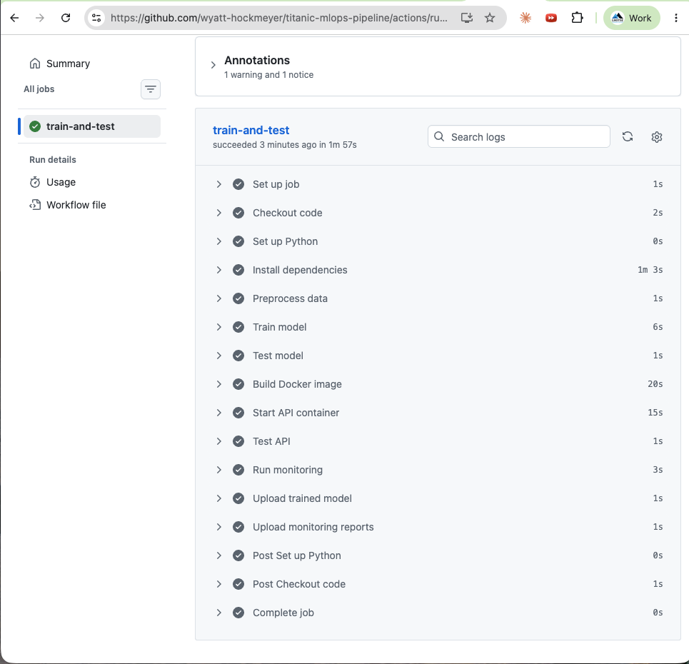
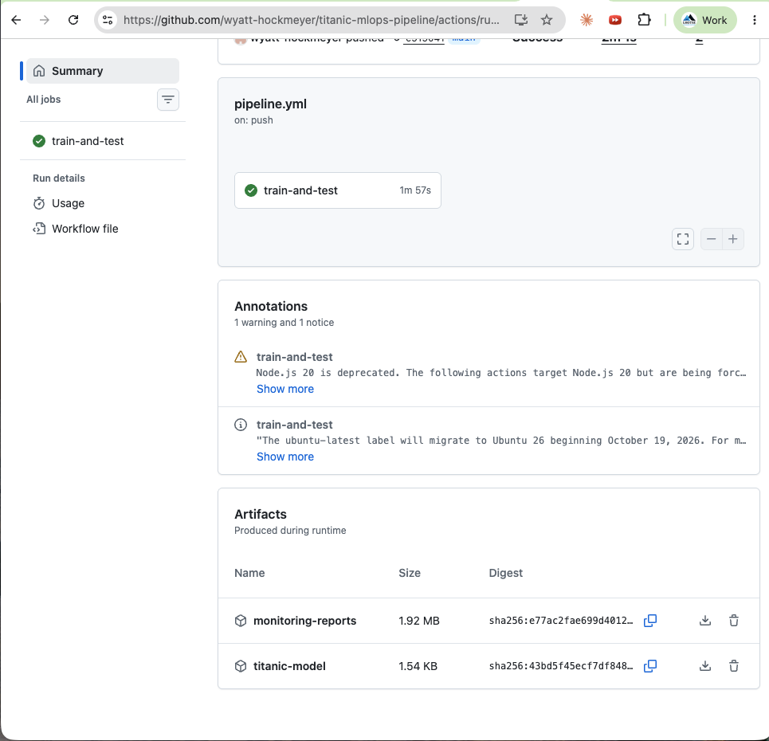
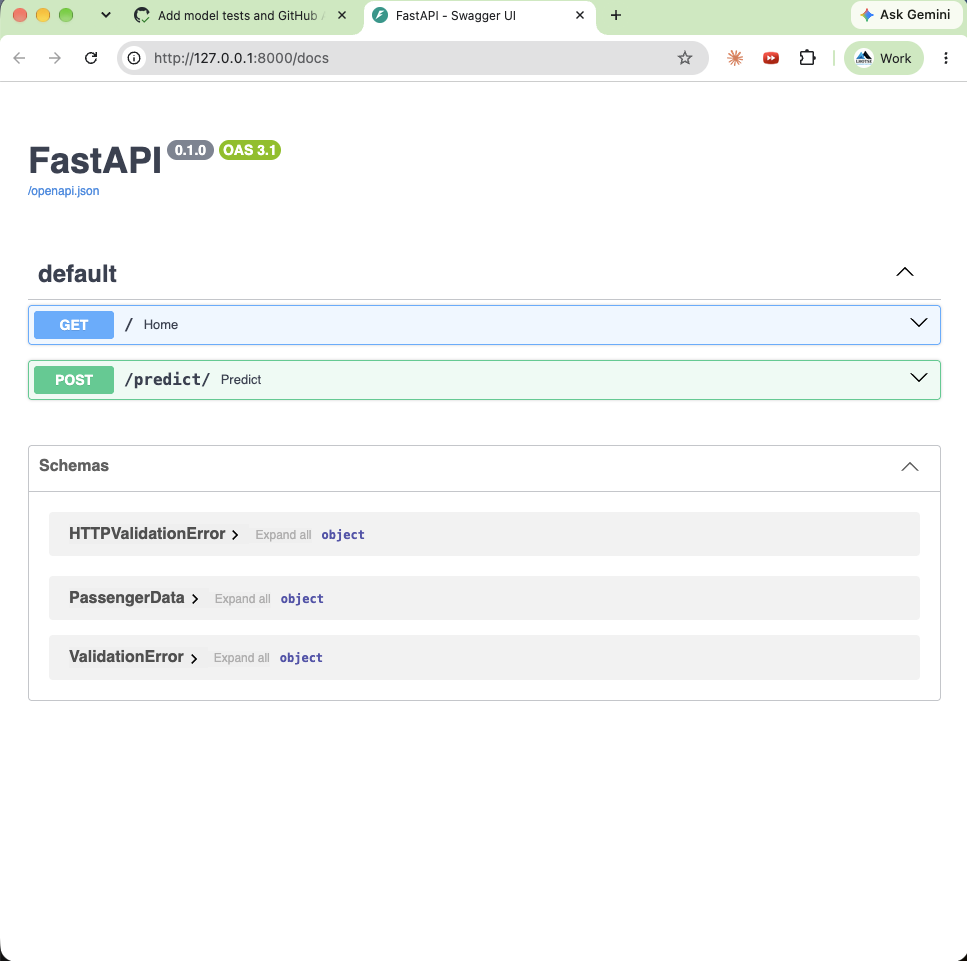
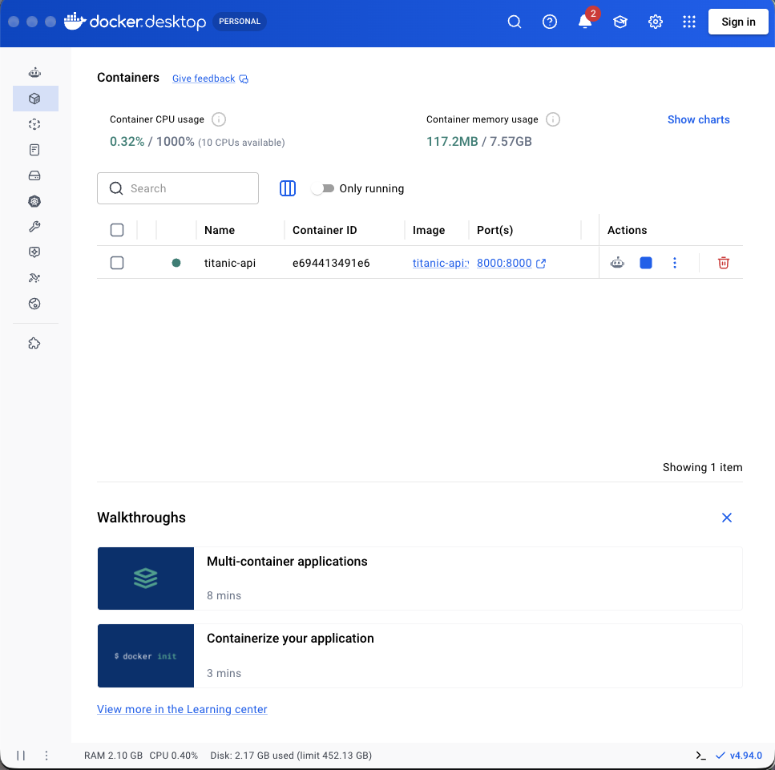
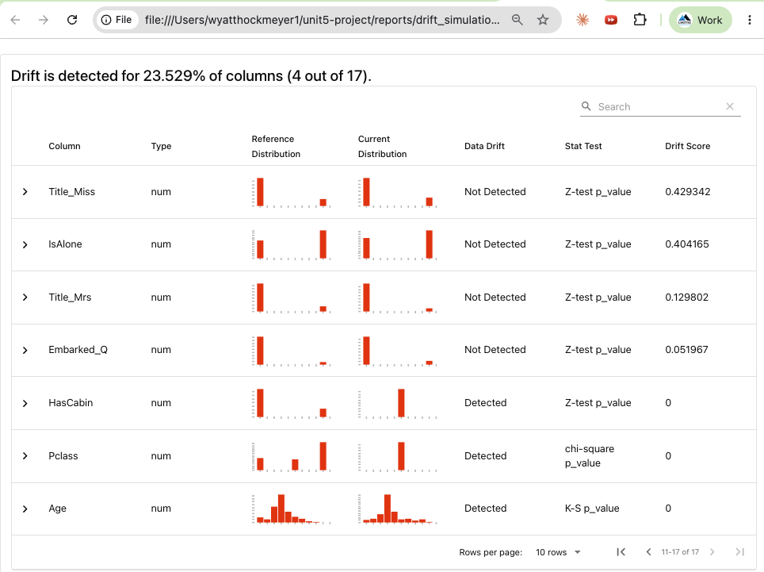

# Project Report: Titanic MLOps Pipeline

**Author:** Wyatt Hockmeyer
**Course:** Unit 5, Machine Learning Operations
**Repository:** https://github.com/wyatt-hockmeyer/titanic-mlops-pipeline

## 1. Objectives and significance

The assignment called for a complete, automated, monitored, and version-controlled machine learning system. The scenario described predicting 30-day hospital readmission; the dataset provided was the Titanic passenger dataset, so the model predicts passenger survival. The engineering problem is the same either way: take a classification model from a notebook to a tested, deployed, and monitored service that rebuilds itself when code or data changes.

The significance is operational. A model that scores well in a notebook delivers no value until it can be trusted in production. This project addresses what that requires: reproducible training, traceable model and data versions, automated quality gates, a secured interface, and early warning when incoming data changes.

## 2. Pipeline architecture

1. **Exploration** (`exploration.ipynb`): data quality review, cleaning, feature engineering, and comparison of three classifiers
2. **Preprocessing** (`preprocess.py`): fills missing values, caps fare outliers, engineers features, and encodes categories
3. **Training** (`train.py`): trains the selected model and logs it to MLflow
4. **Versioning:** MLflow registers each model version; DVC records each version of the processed data; Git records the code
5. **Testing** (`test_model.py`): six checks on data shape, missing values, target values, prediction values, recall, and ROC-AUC
6. **CI/CD** (GitHub Actions): runs every step automatically on each relevant push
7. **Deployment** (`app.py`, `Dockerfile`): FastAPI service with an API key check, packaged in Docker and tested in CI
8. **Monitoring** (`monitor.py`): Evidently drift and performance reports with alert thresholds

### Tool integration

| Tool | Role |
|---|---|
| pandas, NumPy, scikit-learn | Data preparation and modeling |
| MLflow | Experiment tracking and model registry |
| DVC | Data versioning |
| Git and GitHub | Code versioning and hosting |
| GitHub Actions | Automated training, testing, packaging, and monitoring |
| FastAPI and Uvicorn | REST API |
| Docker | Portable, consistent deployment |
| Evidently AI | Drift and performance monitoring |

## 3. Data and features

The dataset has 891 passengers and 12 columns, with no duplicate rows. Three columns had missing values: `Age` (177), `Cabin` (687), and `Embarked` (2).

- `Age` was filled with the median (28.0) and `Embarked` with the most common port (S).
- `Cabin` was 77% empty, so it was replaced by `HasCabin`, a flag for whether a cabin was recorded. Passengers with a cabin record survived at 66.7%, against 30.0% without.
- `Fare` had 116 high outliers; the top 5% was capped at 113.275 rather than removed.
- New features: `FamilySize`, `IsAlone`, and `Title` extracted from passenger names. Title separated boys (Master, 57.5% survival) from adult men (Mr, 15.7%).

## 4. Model selection

| Model | Accuracy | Precision | Recall | F1 | ROC-AUC | CV ROC-AUC (std) |
|---|---|---|---|---|---|---|
| Logistic Regression | 0.832 | 0.800 | 0.754 | 0.776 | 0.872 | 0.869 (0.011) |
| Gradient Boosting | 0.804 | 0.793 | 0.667 | 0.724 | 0.841 | 0.879 (0.026) |
| Random Forest | 0.793 | 0.735 | 0.725 | 0.730 | 0.834 | 0.853 (0.033) |

Logistic Regression was selected. It led on all five test metrics, and its test ROC-AUC closely matched its cross-validation score, while Gradient Boosting dropped about 0.04 between cross-validation and test. Recall was treated as the priority metric because, in the readmission scenario, a missed high-risk case costs more than an unnecessary follow-up. Logistic Regression missed the fewest positive cases (17 of 69).

## 5. Results and evidence

### Experiment tracking (MLflow)

Parameters and all five metrics logged for each run:

Each run registered as a new model version:

### CI/CD (GitHub Actions)

Every step passed, from training through container testing and monitoring:

Each run publishes the trained model and the monitoring reports as artifacts:

### Deployment (FastAPI and Docker)

Auto-generated API documentation showing the prediction endpoint and input schema:

The API running in Docker. All four API tests passed against the container: a likely survivor (probability 0.97), a likely non-survivor (0.093), and rejection of a wrong or missing API key with status 401.

### Monitoring (Evidently AI)

Under normal conditions, no columns drifted and accuracy was 0.832, with no alerts. In the simulated shift, Evidently detected drift in `Age`, `Pclass`, `HasCabin`, and the model's predictions (4 of 17 columns, 23.5%). Accuracy fell to 0.726, and both alerts fired.

## 6. Lessons learned

1. **Environment control is a large share of the work.** The newest Python (3.14) was too new for the tool stack; Python 3.12 resolved it. Pinning the API's package versions guaranteed the container could read the model.
2. **Tools change faster than course materials.** MLflow 3.16 no longer accepts the demo's file-based tracking store, so tracking moved to SQLite, and a parameter was renamed. Reading current documentation was part of the job.
3. **Cross-validation and test results can disagree.** Gradient Boosting led in cross-validation but not on the held-out test set. Consistency across folds was a better predictor of real performance than the top average.
4. **Automation exposes problems early.** Running the container inside CI meant the deployed artifact itself was tested, not just the code.
5. **Monitoring needs thresholds set before they are needed.** Evidently's default drift flag would not have fired in the simulation; a tighter, deliberate threshold did.
6. **Small process errors compound.** Files saved to the wrong folder, a token pasted into the wrong prompt, and screenshots saved under unexpected names each cost time. A consistent checklist for where files go and what to verify after each step prevented repeats.

## 7. Future recommendations

1. Add a DVC remote (cloud storage) so the versioned data is shared across machines and team members.
2. Fit the fill values and fare cap on the training set only, inside a scikit-learn Pipeline, to remove the small leakage noted.
3. Move the API key to a secrets manager and add rate limiting before any public deployment.
4. Schedule monitoring to run on real incoming data, and trigger retraining automatically when an alert fires.
5. Publish the Docker image to a registry and deploy it to a cloud container service.
6. With real readmission data, tune the decision threshold to favor recall and validate the model for fairness across patient groups.